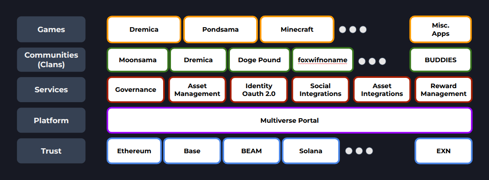

# Moonsama Technology

Moonsama's technology stack has been refined and battle-tested for over 3 years, meticulously designed to accelerate the deployment of NFT-powered solutions to market. By leveraging Moonsama's comprehensive Utility layer, builders can bypass critical development hurdles, allowing them to focus exclusively on the unique value propositions of their applications.

Moonsama's technology stack follows a layered architecture, similar to the OSI model in networking. Each lower layer provides foundational services and capabilities that support the layers above it, creating a cohesive ecosystem where components build upon each other. This hierarchical design ensures modularity, scalability, and clear separation of concerns across the entire platform.

### Trust Layer
Moonsama operates as a robust multi-chain ecosystem where digital assets — including NFTs and tokens — are securely stored on various blockchains. The platform's services are strategically anchored into these diverse trust layers, ensuring maximum security, interoperability, and flexibility for users and developers alike.

New blockchain integrations are added based on demand and strategic importance.

### Multiverse Portal
The bridge between traditional web and blockchain worlds, where users can easily manage all their digital assets in one place and seamlessly connect with games and applications. For developers, the Portal eliminates the complexity of blockchain integration, providing ready-made solutions for asset management and token economies—saving months of development time.

Users simply connect their wallets to their Moonsama Account, while games and apps can integrate with these accounts through standard OAuth. The Portal's straightforward API gives developers everything they need to read and manage digital assets without diving into blockchain complexities.

### Services
The Moonsama Platform offers a comprehensive suite of ready-to-use services that create immediate value for builders and users:

- **Access Control**: Token-gated chats and exclusive content (characters, items, stories, areas)
- **Community Tools**: Token-based governance for Clans and leaderboards
- **Economic Engines**: Campaign-based soft-staking, NFT lending with reward sharing
- **Payment Processing**: Seamless handling of fungible tokens as in-game currencies, eliminating complex payment infrastructure development
- **Engagement Systems**: Events and automated reward distribution
- **Seamless Connectivity**: Integrations with social platforms (Discord, Telegram, X) and game ecosystems

These services can be implemented in days rather than months, allowing builders to focus on their unique vision instead of reinventing infrastructure.

### Clans
Communities can form organized groups called Clans on the Multiverse Portal, enabling collective decision-making and allowing their unique NFTs or tokens to be used across connected games. This creates powerful community dynamics while simplifying group management.

### Games & Apps
Games and applications that seamlessly work with blockchain assets. By connecting to the Multiverse Portal through simple APIs and linking to users' Moonsama Accounts, developers can easily incorporate tokens and NFTs into their experiences. Players can unlock special characters, access exclusive content, spend in-game currency, or earn rewards—all without the technical complexity typically associated with blockchain integration.

