# Minecraft Carnage

📣 **Before you continue**, please be sure to read the rules carefully. 

To protect community experience and the integrity of the Moonsama project there is **0 tolerance** for people not adhering to the rules. The current rules can be found here: [Moonsama Carnage Rules](https://mcapi.moonsama.com/carnage-rules). You can also refer [here](https://www.notion.so/14-Minecraft-Carnage-1-73ed65daa36e4218aecebe6981399e57?pvs=21) for more details.

❗**BETA STAGE**. Exporting of Beta ressources is here! 

Check here which are important / exported for each session: [https://mcapi.moonsama.com/carnage](https://mcapi.moonsama.com/carnage)

‼️Alpha Stage ended. Exporting of the alpha resources stopped**.** Now will be the time for the introduction of new crafting utility and launch our new Web3 Gaming Platform.

👉 The Carnage Minecraft (EU and NA) server addresses can be found here:

[Carnage server addresses](https://www.notion.so/11-Setting-up-for-Minecraft-Servers-22be099cd78a42a48f8a44bde9e237fe?pvs=21)

👉 We are using Minecraft Java 1.18.2 update

# **Introduction to the Moonsama Carnage Event**

Carnage event is the first and most important event on Moonsama's first Multiverse test Metaverse, Minecraft. Every week on Sundays at 16:00 UTC, the whole community comes together for 2 hours to play, have fun and farm or fight for resources, which get exported into the Blockchain (Exosama Network, $SAMA) and used to craft cool NFTs on-chain, like skins, weapons and usefull fun tools, as any other gaming experience with the addition of on-chain and Web3 functionalities. The first Moonsama Carnage event took place on the 31st of October 2021, one of the best Halloweens we will always remember, our Moonsamas earned utility! 

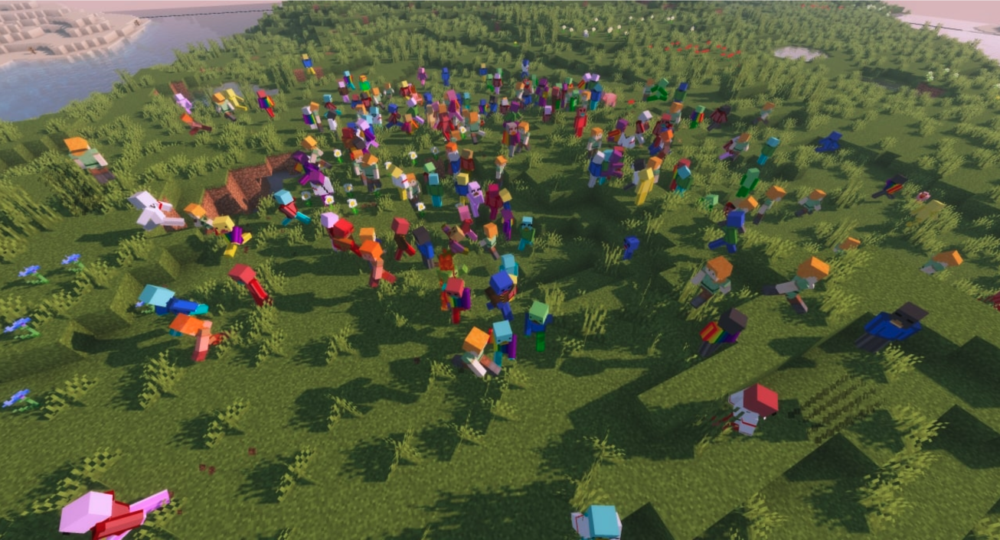

The timing of Sunday at 16:00 UTC was chosen because it the most to our community as a whole, was voted for and agreed upon. 

## **What is the purpose of Carnage Event?**

Our goal is to have fun with the community every week and get as much of those important Minecraft resources (also called Multiverse Assets) above mentioned as possible. Remember, only those which are in our inventory will count, those in chests won't. It's required to play minimum 1 Hour for our loot to be considered.

The Carnage event encompasses multiple servers that can each hold 200 players, dedicated for Europe and for North America, but anyone joins smoothly.

We all start out “naked” with nothing in our inventory besides of our buffs (depending on what are we playing with), 64 soul-bound torches and 4 soul-bound McDonnie’s Burger Patties. Soul-bound means that we can’t loose them if we die. If you have off-hands NFT items bridged you can equip them as well.

Each time we die, our loot will be thrown to the ground for 5 minutes and we can respawn at the central spawn point (the central place where everyone starts). However you can also set a personal respawn point by crafting a bed and sleeping in it, for that you just right click on it, not actually needed to sleep.

Some players will go to forests, some will mine, others will try to hunt other players (PvP) to get their loots and every other combination you can think of!

We will lose health and get hungry, however for the first part of the session this will be taken care of by the McDonnie’s Burger Patties. Just to be sure you do not run out we recommend to find some extra food at the start (from animals, trees, grain…). Additionally, you will need wood to craft all the required tools, so better cut down some trees soon too. Here is what we call “Hotbar” and above it you can see the exp, health and hunger stats.

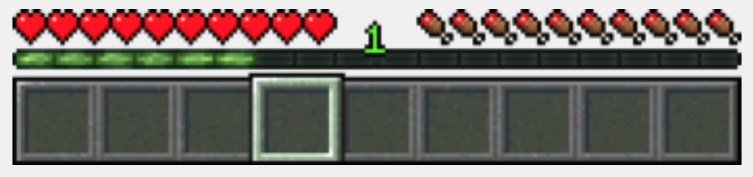

Then it will be time to upgrade our gear to cobblestone tools. Luckily, that can be found everywhere underground and in mountains!

Once you get everything you need, it’s your turn to decide which resources you will go for. A quick difficulty comparison between obtaining some of those resources would be: Cobblestone > Wood > Iron > Gold > Moonstones.
Experience Orbs (EXP) are a bit more tricky to compare as you can get them by mining some items like coal, smelting some ores like gold, killing wild animals and monsters, hunting other players...

Some people play alone, some people play in couples and others in big teams. Take this into consideration for your strategy :)

You can find more details about Minecraft rewards here:

[17 - Carnage Rewards and Crafting ](https://www.notion.so/17-Carnage-Rewards-and-Crafting-fa4a822dfd654fc09ef60110af5352db?pvs=21)

## Moonsama Minecraft Resources

As explained above, the purpose of the Carnage event is to finish the game with as many resources as possible in your inventory.

Some time after each Carnage event, each player’s loot becomes available on the [Moonsama’s Multiverse Portal](https://multiverse.moonsama.com). The Minecraft resources are then bridged to Moonsama Network’s Network as ERC-20 / ERC-1155. This is the same Portal that is used to import and export Moonsama NFTs, VIP Tickets, Embassy passes and offhands. 

On the [Moonsama Marketplace](https://marketplace.moonsama.com/collections) the resources collection is called ‘Multiverse Asset Factory’, the resources provide utility, are transferable and tradable:

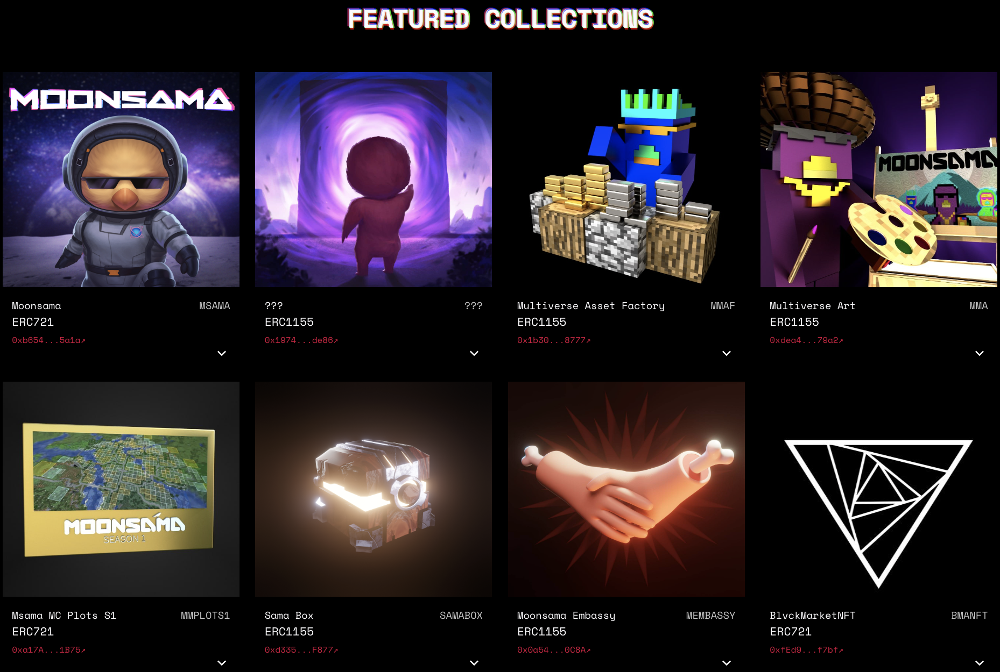

For more details regarding the [Moonsama Marketplace](https://marketplace.moonsama.com/collections), please see:

[7 - Using the Moonsama Websites](https://www.notion.so/7-Using-the-Moonsama-Websites-b756647145c140608e3dc8e5786bfbd9?pvs=21)

### **Multiverse Asset Factory**

The Multiverse Asset Factory collection contains the resources that can, could or will be able to be obtained in the Carnage event which can be bridged on-chain to your Moonsama Network address:

- aStone - Cobblestone
- aWood - Wood (Logs, directly from trees)
- aIron - Iron Ingots (smelted iron ores)
- aGold - Gold Ingots (smelted gold ores)
- aMoonstone - They more or less replace Minecraft diamonds
- aExp - Experience Orbs (EXP)
- aGrain - Harvested wheat
- aString - Spider String
- aFish - Fish caught with the Moonrod
- aBait - Bait for catching aFisk with the Moonrod
    
    (please note aBait is crafted from aGrain and cannot be obtained directly)
    

About Moonstones:

- They can still be crafted ingame into swords, tools and armor like diamonds (these can’t get exported).
- In-game Moonstone Swords are NOT the upcoming Moonsword NFTs
- Ores can be found between Y: -63 to 14
- Ore clusters can consist of 1-12 ores in a vertical arrangement, with gaps between ores
- Most clusters will only consist of a single ore

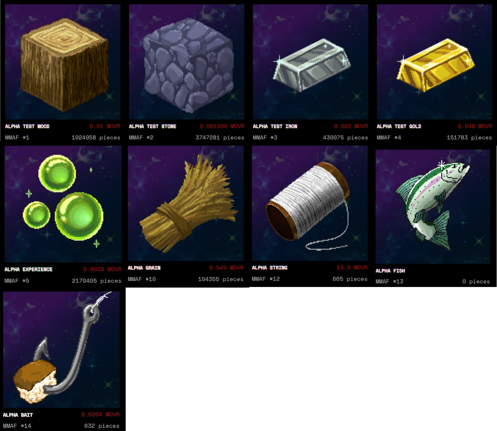

## Carnage Event Features

Moonsama Carnage has several different characteristics introduced, both "negative" and "positive", for encouraging players to play more clean, honest and also balance the game a bit to some minimum levels, as we know the gap between new players and "pros" can be really huge. These little changes were introduced little by little, definitely worked and made the sessions even more fun!

### General Carnage features

The features listed below apply to every Carnage players:

- **Click [here](https://www.notion.so/11-Setting-up-for-Minecraft-Servers-22be099cd78a42a48f8a44bde9e237fe?pvs=21) to find the Carnage server addresses**
- **You need one of the following to Access Carnage:**
    - Moonsama
    - Exosama
    - VIP Ticket (also known as “???”)
    - Gromlins
    - Embassy Pass (Invited communities. In the case of the EXO pre-mint, it shouldn’t work)
- **PVP protected** for the first 5 minutes.
- **64 torches with Soulbound.** They will stay in your inventory even if u die.
- **4 McDonnie’s Burger Patties with Soulbound.** They will stay in your inventory even if u die.
- **Fear of the Dark.** When you're in complete darkness, you get the warning of this fear of the dark crippling you. Then, after some time, you will suffer from heavy debuffs like blindness, weakness, mining fatigue and bad luck. This will force you to use any kind of block light source, such as torches and furnaces.
- **Combat Logging Prevention.** You turn into a zombie for 20 seconds if you disconnect and one of these 2 conditions occur: another player is within 32 blocks of you and/or 64 blocks of you + has direct line of sight to you.
    
    This zombie stays for another second with every hit suffers. If it dies, it drops all your items and experience orbs like when you die. The next time you join you respawn with an empty inventory.
    
- **Bounty Hunting.** If you kill someone, a red aura will get stuck to you and will be seen through walls.
- **Gulag.** People who misbehave can be voted into the Gulag by Moonsama holders. This will place a permanent bounty on them with a red aura from "Bounty Hunting", until they improve their behaviour and voted out.
- **Disconnect protection.** If u disconect from the server for any issues you can have during the session, we will keep you whitelisted for 10 minutes so you can join again and not loose your spot.

### Moonsama NFTs specific features

The Moonsama Carnage features mentioned here only apply to those players that have one or more Moonsamas / Multiverse Art Skins bridged:

### **GGANBU**

"Gganbu (간부) always share everything with each other no matter what".

Right now we have a sharing system implemented where a variable % of everyone's loot is taken and shared between the Moonsama holders who participate in the event for minimum 1 hour.

<aside>
⚠️ Please note: The Gganbu % share is subject to change. To check it in-game, please type in chat the word “gganbu” to note the active event % share.

</aside>

### Buffs and Enhancements

Depending on the type of Moonsama skin or amount you have bridged to the Minecraft Metaverse, it will offer Buffs and health points and damage boosts as per the below graphic:

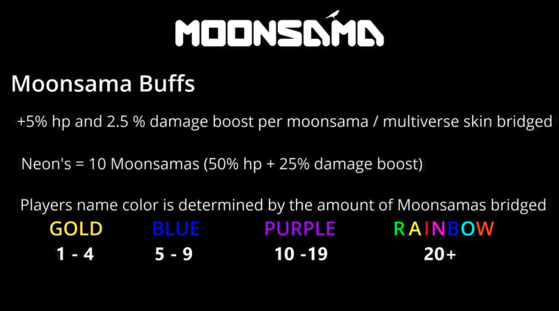

<aside>
⚠️ Please note: It is recommended not to attack any Moonsamas with significant buffs as they are deadly! ☠️

</aside>

# Carnage Instructions ****

Now that you have been informed regarding the background and purpose of the awesome Carnage event we will outline further important information.

## Quick reference info graphic

To help you prepare as much as possible before the Carnage event please find the below info graphic. The steps mentioned are all discussed in detail in this wiki, you can use it as a checklist:

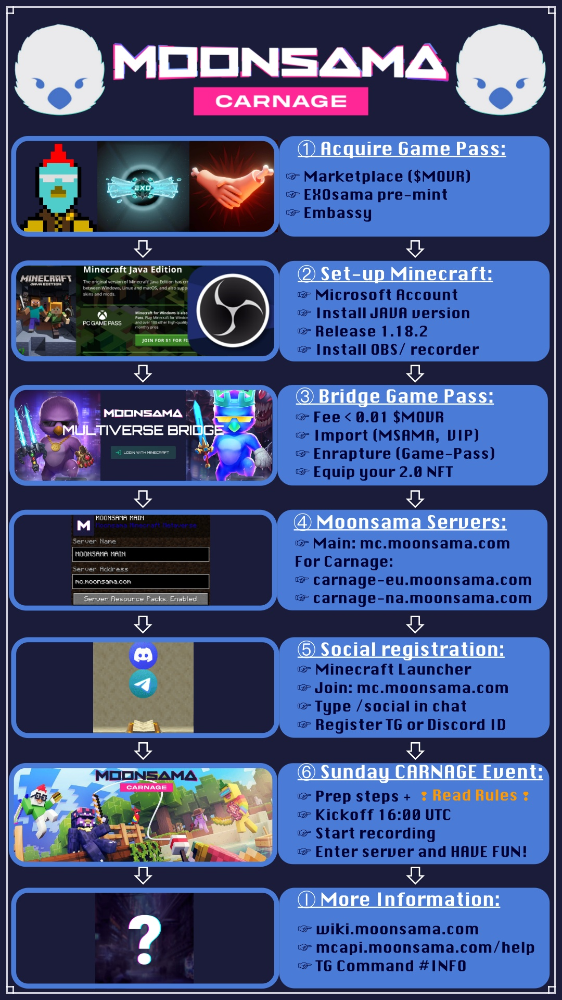

## Instructional video guide

To help with getting ready to play in carnage, the video below will guide you through using the Moonsama website, bridging your NFT game pass / VIP ticket / Moonsama into the Moonsama bridge, setting up Minecraft and recording your gameplay. 

[https://youtu.be/F5mS28cAgZE](https://youtu.be/F5mS28cAgZE)

## Server address

Firstly both EU / NA Carnage server addresseses can be found here:

[Carnage server addresses](https://www.notion.so/11-Setting-up-for-Minecraft-Servers-22be099cd78a42a48f8a44bde9e237fe?pvs=21)

💡 **Please note:** if you are asked to enable Resource Packs when joining please do so.

## Complete Carnage Preparation

Before you can enter the magnificent Carnage lobby, you will first need to complete your preparations. This is required for administrative purposes, you can do this right before Carnage, however to save time you can also log in to [mc.moonsama.com](http://mc.moonsama.com) shortly before Carnage and type command /carnage_tutorial in chat. This will allow you to take some time to study the rules and link your socials.

📣 Please note any preparation step (e.g. social handles) you have passed in earlier Carnage sessions will be automatically skipped. In case there is a new rule update you will need to accept the rules again.

### Step 1: Reading and Accepting Carnage rules

To pass this step you will be asked to carefully read the current Carnage rules, which are described in the [rule section](https://www.notion.so/15-Minecraft-Carnage-e4def94bf060444c85cf0576bc856ff8?pvs=21), and confirm this by entering a personalised code in Minecraft chat.  

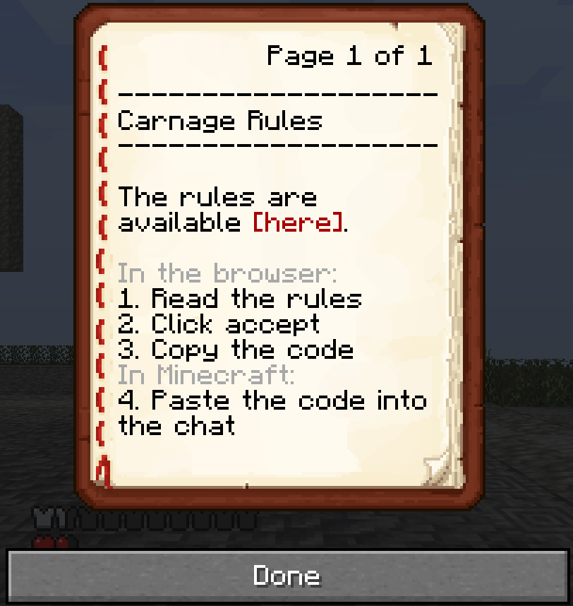

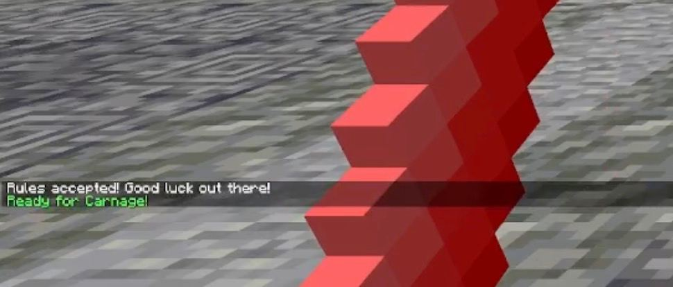

### Step 2: Linking your social handle

To pass this step, you are required to link either your Telegram or Discord handle to your Minecraft account. This is to ensure the Moonsama team or Committee can communicate with you should a need arise for the review of fair play or to request a gameplay video of a session This can be done while starting your Carnage session, however to save time please ensure to complete linking your telegram or discord account in game as described **[here](https://www.notion.so/11-Setting-up-for-Minecraft-Servers-22be099cd78a42a48f8a44bde9e237fe?pvs=21)** . If you do this beforehand this step will be skipped.

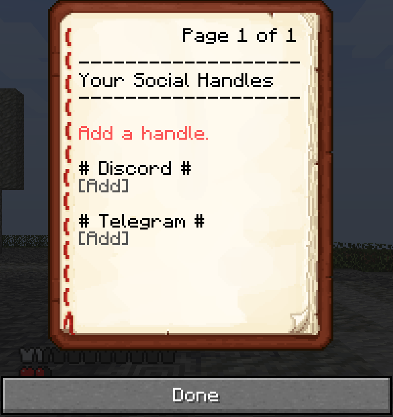

### Step 3: Lobby - Choose your server

After you have completed the preparation steps you will find yourself in the magnificent Moonsama Carnage lobby:

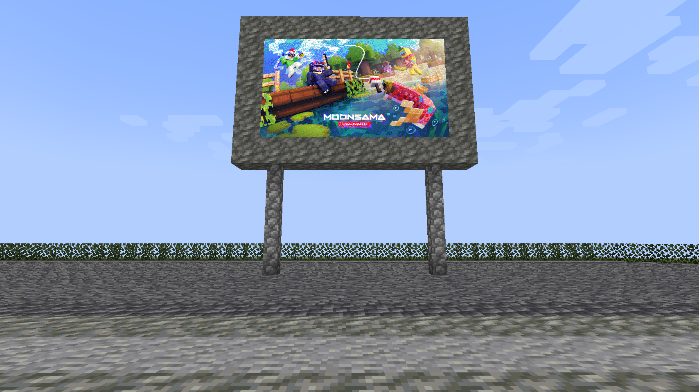

Now you can choose your server by jumping into one of the dragon heads:

<aside>
📣 It is highly recommended to switch on your [screen recording](https://www.notion.so/15-Minecraft-Carnage-e4def94bf060444c85cf0576bc856ff8?pvs=21) software before entering one of the dragon heads!

</aside>

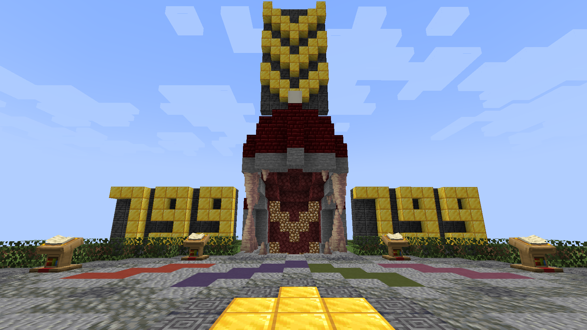

Once you jump into one of the dragon heads you will see the below screen where you can confirm one of the servers:

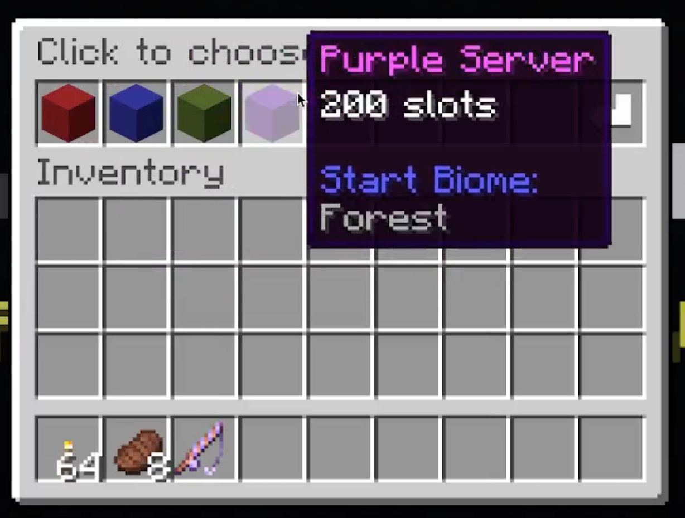

💡 You will see the below screen after you choose a server this is a normal behaviour.

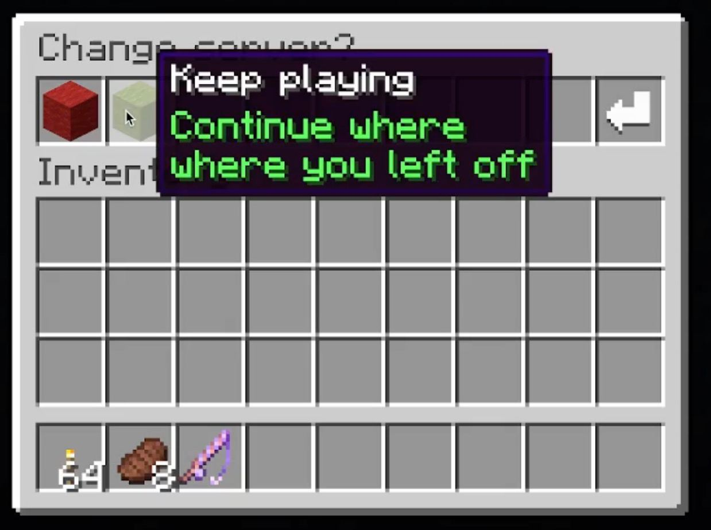

### Recording confirmation

This is the final step before you are ready for Carnage! Here you need to confirm that you are recording (this is highly recommended).

To confirm you are recording click the green box:

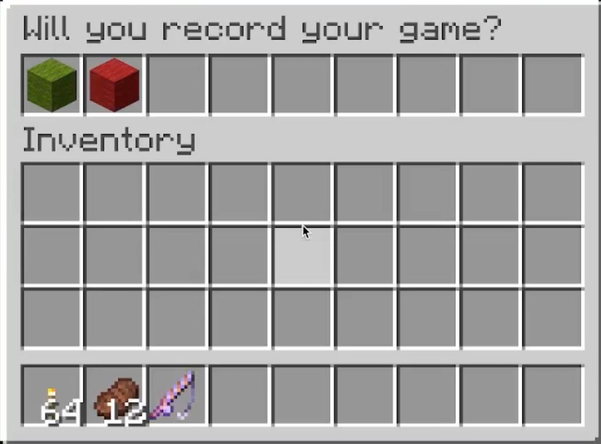

This will lead to next and final preparation step open your F3 screen and type done in chat:

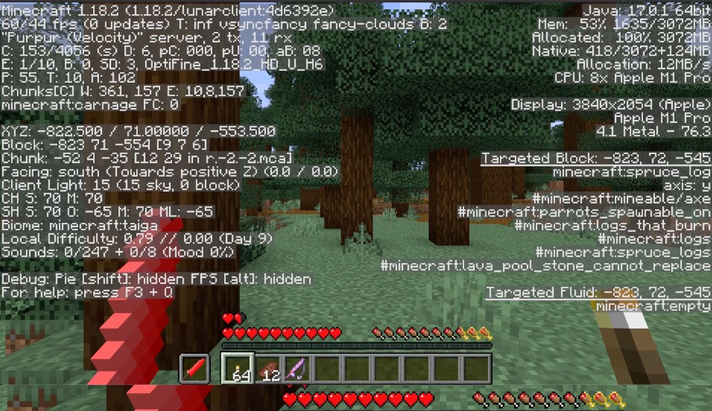

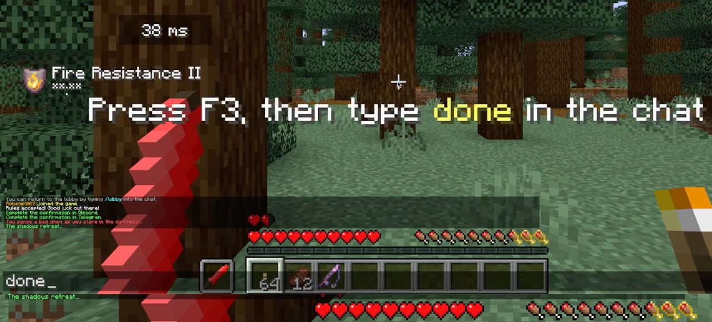

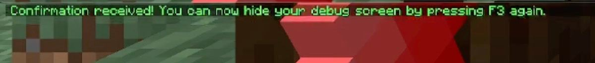

**That’s it now you’re fully prepared, good luck!**

💡 After you have joined a server and you want to switch, you can do so by typing command **/lobby** in game chat. This will only work as long as Carnage has not started yet.

## Upgrading your Minecraft skills

Minecraft can be quite a challenging game, to provide assistance Moonsama provides you with Lokito’s Academy, check here for more details:

[Introducing Lokito’s Academy](https://www.notion.so/Introducing-Lokito-s-Academy-1e134dd609e343a79d7e525abd482339?pvs=21)

## Minecraft Metaverse Services - Carnage

🌐 [https://mcapi.moonsama.com/carnage](https://mcapi.moonsama.com/carnage)

The Minecraft Metaverse services webpage provides the latest information on the next carnage this is available at the link here: [https://mcapi.moonsama.com/carnage](https://mcapi.moonsama.com/carnage)

✍️ Please note the above webpage also lists useful Carnage information including:

- A countdown for the next Carnage to begin
- The server address
- The rules for Carnage to view
- Updates/patch notes for any changes or improvements to the game

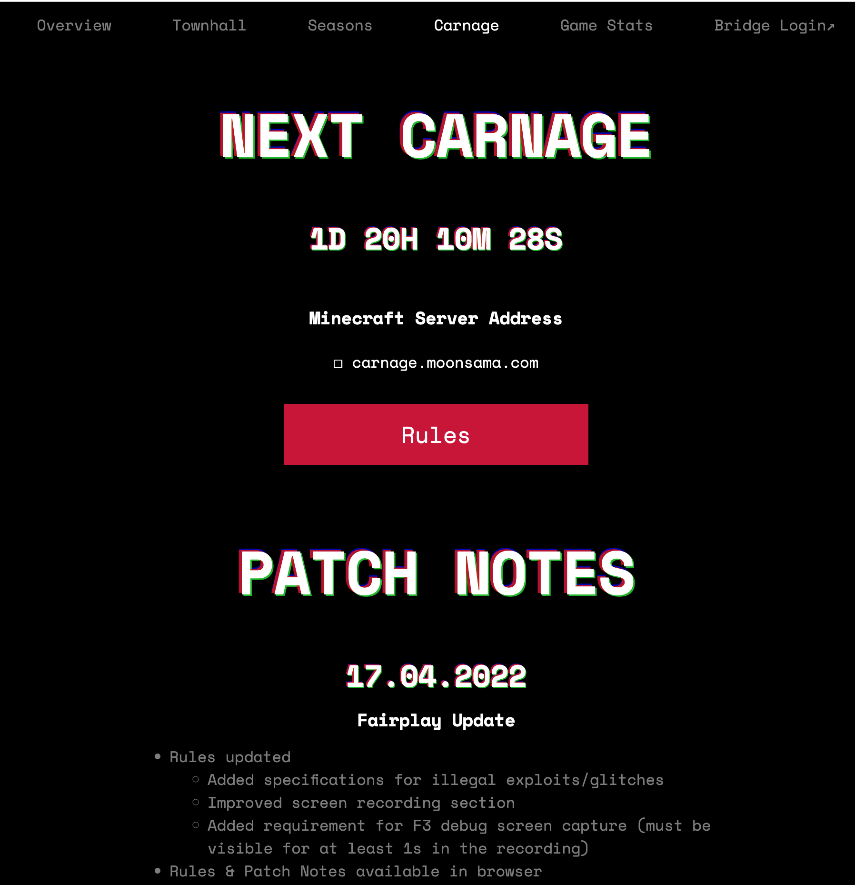

### Game Stats

Also available on the Minecraft Metaverse Services website, there is a section for **Game Stats** which provides the following information:

- **Leaderboard** - highlighting the best players for each resource acquired in the Carnage event.
- **Gganbu** - an option to search and view your own resource Gganbu allocation for that Carnage event.
- **Personal** - an option to search and view your own resource allocation (after Gganbu distribution) for that Carnage event.
- **Final** - This is the final allocation following Gganbu and personal distributions.
- **Recordings -** Here you can have a look at the recordings provided by top players, can be very helpful

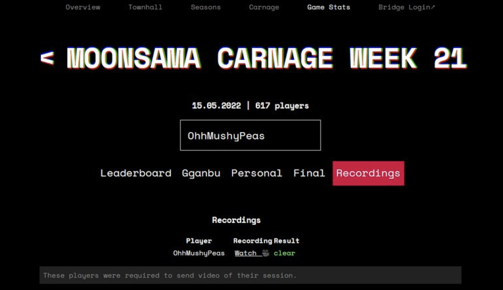

# Carnage **Rules of Engagement**

Carnage is the event where most of the community comes together each week, to have fun with their community friends and to compete. 

To protect the community experience and the integrity of the Moonsama project there is 0 tolerance for people not adhering to the rules. 

**To** **make sure everybody has fun, read this section carefully!**

⚠️ **Please note:** 
Before you can start your can enter the Carnage event Lobby you will need to pass the 7 Carnage circles as outlined in the previous section. One of the circles concerns reading and formally accepting the rules.

## Current Moonsama Carnage rules

All of the current Moonsama Carnage rule can be found here:

[https://mcapi.moonsama.com/carnage](https://mcapi.moonsama.com/carnage)

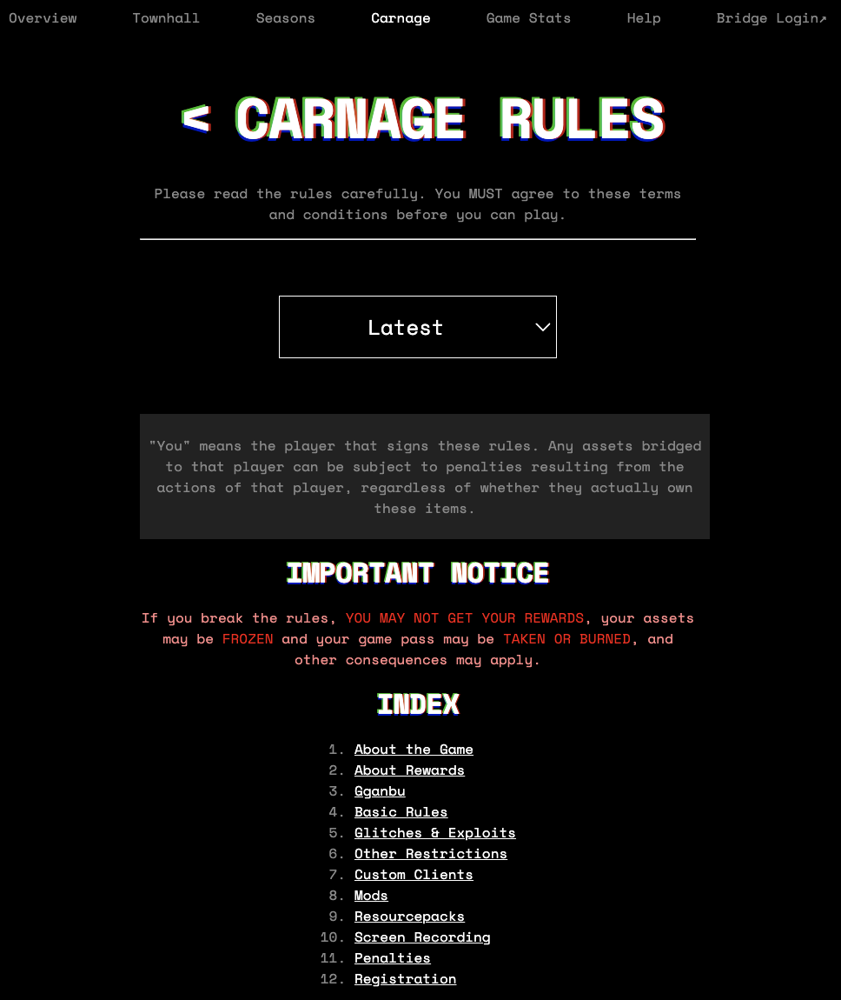

📣 Be sure to read and comply to these rules carefully, if you have questions reach out!

## Anti Cheat Measures and Penalties

Below you can find some more considerations regarding the rules:

Moonsama Minecraft does not allow cheats, this is crucial to protect the game and the project’s integrity.

- Anyone who is caught breaking the rules may be sent to the gulag, banned temporary or even permanently.
- Cheaters jeopardise their Moonsama / VIP Ticket / Multiverse Art Skin NFT, it will be forfeit and burned.

**Measures**

- For anti cheat purposes, all Moonsama Minecraft servers are running detection and prevention routines, for instance for 3rd party cheats.
- Server admins are monitoring and players are recording sessions.
- There is a Moonsama Police and a Moonsama Court.
- People are encouraged to report cheating vulnerabilities to the team

In general, in the end if you cheat you will get caught, so please don’t even try!

**Carnage - Top 10**  

- ⚠️ Please note: If you are logged as one of the top 10 players in a carnage session for Iron, Gold, String and EXP it is highly possible that you will be notified (via Moonsama telegram and discord channels and direct contact via telegram or discord will also be used where required) the recording of your session to be reviewed by Moonsama Police and Court, so that they may verify the resources have been acquired fairly.
- If you do not the resources will not be released following the Carnage session to you.

**Carnage - Flagged for gameplay review** 

- ⚠️ Please note: If you are flagged (random or to verify carnage session) as a player for gameplay review, then you will be notified (via Moonsama telegram and discord channels and direct contact via telegram or discord will also be used where required) to provide the recording of your session for review by the Moonsama Police and Court, for verification purposes  that the resources have been acquired fairly.
- If you do not the resources will not be released following the Carnage session to you.

## Recommended recording software for carnage:

- As per mentioned above whether flagged for review or not it’s best practice and highly recommended to record your game regardless.
- The specific rules regarding your recording can be found here:
    - [https://mcapi.moonsama.com/carnage-rules#10-screen-recording](https://mcapi.moonsama.com/carnage-rules#10-screen-recording)
- We recommend the following software to use for this purpose:
    - [https://obsproject.com/](https://obsproject.com/)

The infographics below will assist you to configure OBS in such a way that it’s compliant with the rules and has a low impact on the performance of your PC or Laptop:

This first info graphic describes how to configure the basic settings required for your Carnage recording:

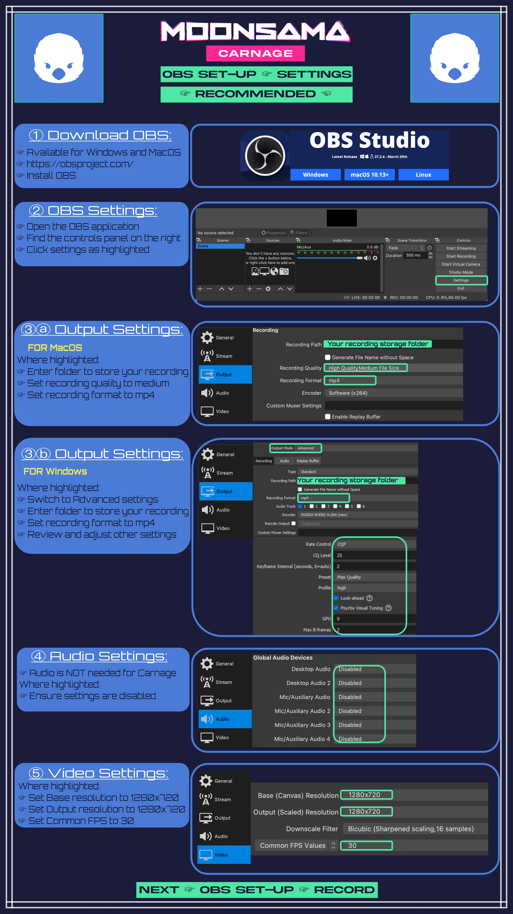

The below second info graphic describes how to further configure OBS for your Carnage recording:

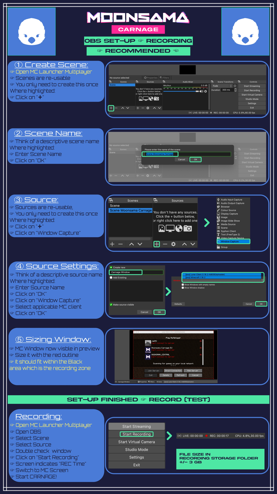

:::tip
Configuring OBS as outlined in the previous two info graphics will only need to done **once**.

To start your recording before joining a particular server in Carnage you only need to do what is described in the step “Recording”.
:::

## **Allowed Clients**

We recommend to use the original Minecraft launcher. However OptiFine modification, Lunar and Badlion clients are also allowed. These clients offer several modifications. Modifications that give you an unfair advantage over other players are strictly forbidden.
