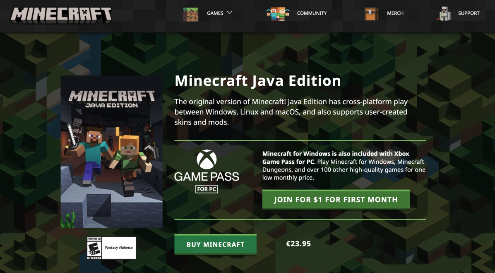

# Setting up Minecraft Client

# **Getting Minecraft Setup**

Before you can join the Moonsama Minecraft metaverse you need to make sure that you have properly installed the correct version of Minecraft.

:::note
If you have a Mojang account please migrate to Microsoft account.

We currently using Minecraft Java with 1.18.2 update.
:::

This lesson will explain how to install Minecraft **Java** version on your PC or laptop:

1. The Minecraft installation is linked to your Microsoft account, in subsequent lessons we will call this "Minecraft Microsoft account". If you do not have one it is advised to create it before you proceed, as this will make the rest of the process a little easier and you have more control over your Microsoft account settings. You can however also create a new Microsoft account during the installation process below. You can get a Microsoft account in several ways, for instance by following this URL: [outlook.live.com/owa](https://outlook.live.com/owa/). After you follow this url click "Sign in" and then "Create one!" in the dialog box.

:::caution
Make sure that you enter a backup email and/or backup phone number, this is needed in case you lose the password for your Microsoft account.
:::

2. Follow this URL in your browser: [minecraft.net/en-us/store/minecraft-java-edition](https://www.minecraft.net/en-us/store/minecraft-java-edition).

3. Now click "Buy Minecraft", this will lead to a login screen.

:::tip
As mentioned in step 1 you can also create a new Microsoft account here by clicking "Create one".
:::

4. Next you will be asked to choose a gamertag, gamertags are used for Microsoft accounts. If you view your Microsoft account online, you will see your gamertag as your account name and not your Minecraft profile name (see step 6). Any purchase information and account settings tied to your Microsoft account will display your gamertag. This is NOT the name that you will have in the Moonsama Metaverse, however it may make sense to keep your Minecraft profile name (step 6) and username aligned.

5. After you click "let's go" you are taken to the purchase screen.

After you complete the payment process you will get a confirmation.

6. Next click on "Set up your Minecraft profile" you will be asked to choose Minecraft profile name:

This is the name that you will have in the Moonsama Metaverse, many people have chosen to use a name here that matches their TG handle:

:::note
The Minecraft profile name can only be changed after 30 days, so choose wisely.
:::

7. Now it's time to download the Minecraft launcher, click "Download Launcher" and the download will begin:

If you need the Minecraft Launcher for another OS (when you change PC) or if there is an issue with the download you can also use this url to download manually:

[minecraft.net/en-us/download](https://www.minecraft.net/en-us/download)

8. Once completed you will have a .dmg file for MacOS or a .msi file for Windows, install this as you would normally.
9. After you have installed the Minecraft launcher you can start it, then you will need to login with your Minecraft Microsoft account (choose Microsoft Login):

10. Once you have logged in you will see the below screen:

🎉 **Congrats!**

You have now successfully installed Minecraft Java edition on your PC or Laptop and linked it to your Minecraft Microsoft account!

You are now ready for next lesson, which explains how to bridge your Moonsama NFT to the Moonsama Metaverse! Lesson after next will explain how to setup and connect to the various Moonsama Minecraft servers.