# Setting up for Minecraft Servers

# Setup for each Minecraft Server

This lesson outlines the steps for setting up available Moonsama Minecraft Servers.

Now that you are the proud owner of a Moonsama NFT, you have successfully installed Minecraft and you have your Moonsama NFT safely on the bridge, you are ready for your first Moonsama Minecraft session. This lesson explains how you can add the various Moonsama Minecraft servers to your Minecraft installation, when this is completed you can begin!

**Follow these general steps for adding Moonsama server addresses:**

1. Ensure you have a Microsoft account and that you have Minecraft Java version installed properly as explained in lesson 7.
2. The Moonsama Minecraft servers use **release 1.18.2**. This release is automatically available in your MC launcher.
3. Open Minecraft Launcher (it should automatically login with your MineCraft Microsoft account):

4. Initialise a game (actual working minecraft client version in example 1.18.2 you can find in Moonsama social channels), by clicking play, this leads to the following screen:

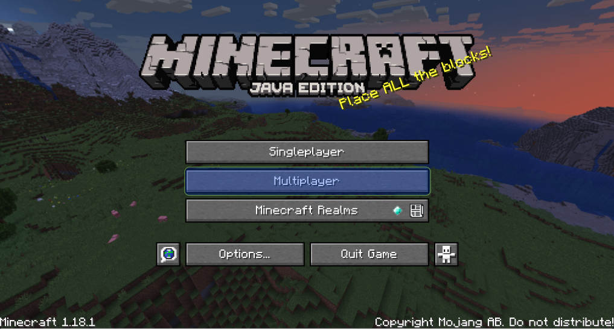

5. Select Multiplayer and click "Proceed" in the screen below:

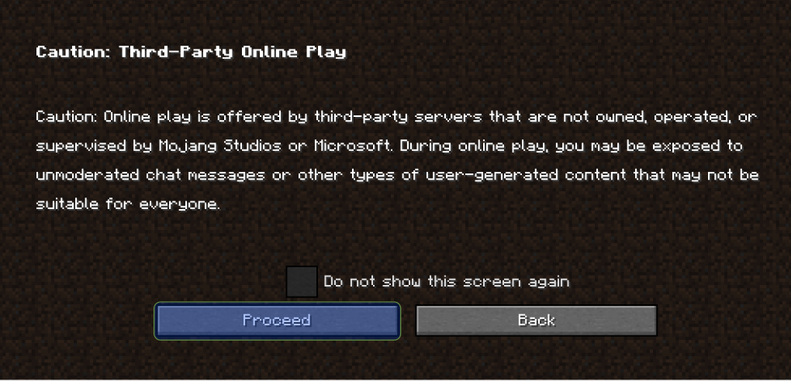

6. Now you will see the below screen, it shows all your available servers. Initially this screen will be empty. In the example below several servers have already been added. To explain how you can add servers we will show you how the season server should be added. At the end of this lesson all available Moonsama Minecraft servers have been listed, to add these you should follow the same process as in the following example.

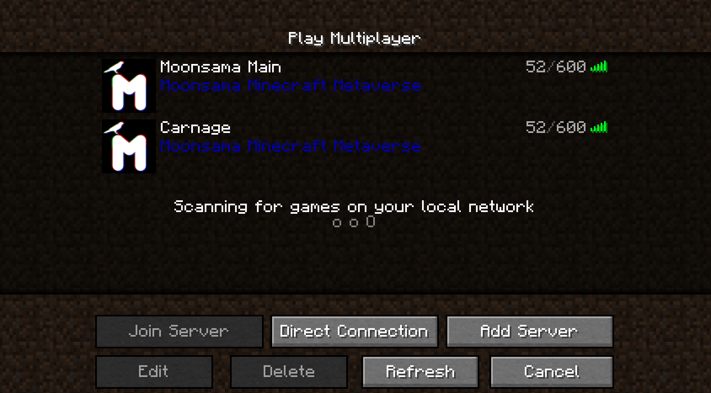

7. Click "Add Server" and:
- Give the server a specific name such as “Moonsama Main” so the purpose of the server is clear to you.
- Input the appropriate server address, in this example: "mc.moonsama.com". (next section outlines all available servers)
- Set resource packs to "Enabled" - as shown below:

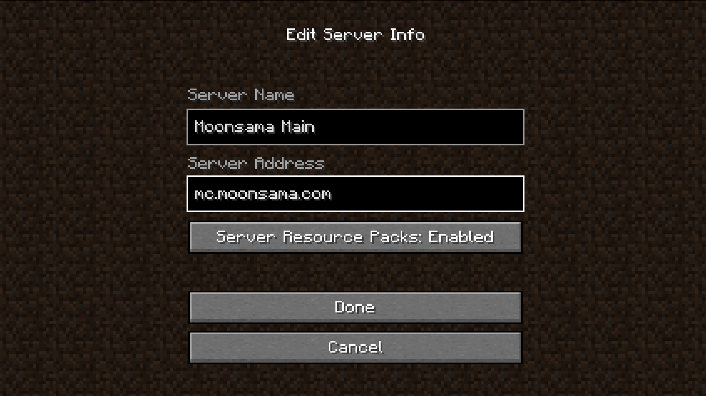

8. Click "Done" now you see the server in the servers overview:

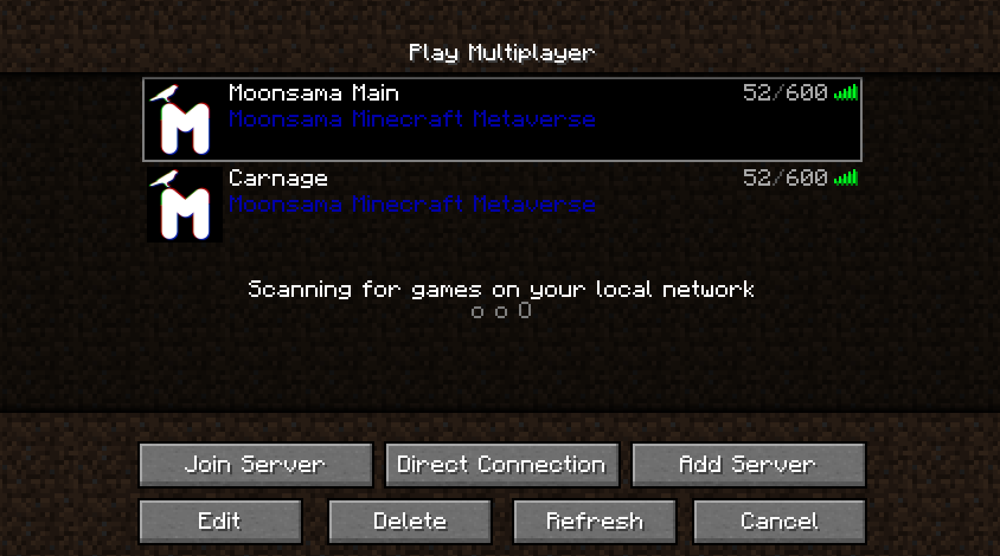

9. To start your session select the server as shown in the screenshot above and click "Join Server", now the session will start and you will begin in the lobby for Moonsama Minecraft.
10. As can be seen in the image from the lobby below you can now select between the following servers to visit:
- townhall
- canary
- academy
- chaos
- season

:::note
📣 Please note as an alternative to walking through an arch to enter one of the servers listed above you can instead use / commands in the in-game chat by first typing ‘t’ then the following and press enter:
/townhall 
/canary
/academy
/chaos
/season
:::

:::note
⚠️ ‼ **Please note that Carnage has 3 separate regional server types, you will need to add one of these servers to play in Carnage. Choose the server that is closer to your location:**

**Europe/Asia:**

carnage-eu.moonsama.com

carnage-eu-2.moonsama.com

**America/Asia:** 

carnage-na.moonsama.com

carnage-na-2.moonsama.com

**Asia/Pacific:** 

carnage-ap.moonsama.com

‼ **Keep in mind that you you may only play on one of these servers, attempts to circumvent this rule will result in severe penalties**
:::

## ⚠️ Important - Linking your Telegram or Discord Handle

:::note
To ensure that the Moonsama team and committee can communicate with all Moonsama Minecraft players (should a need arise for gameplay or review of fairplay) you are required to link your telegram or discord handle with the Minecraft bridged account. Below you will find the steps to do this, the first 4 steps are equal for either Telegram or Discord:
:::
**General Steps to link your Social handle**

(1) After configuring your Minecraft servers above, please go to **/townhall** 
(2) As you enter the Townhall building before entering the main hall seating, to the left and right of the opening there are Social Handle points as shown below.

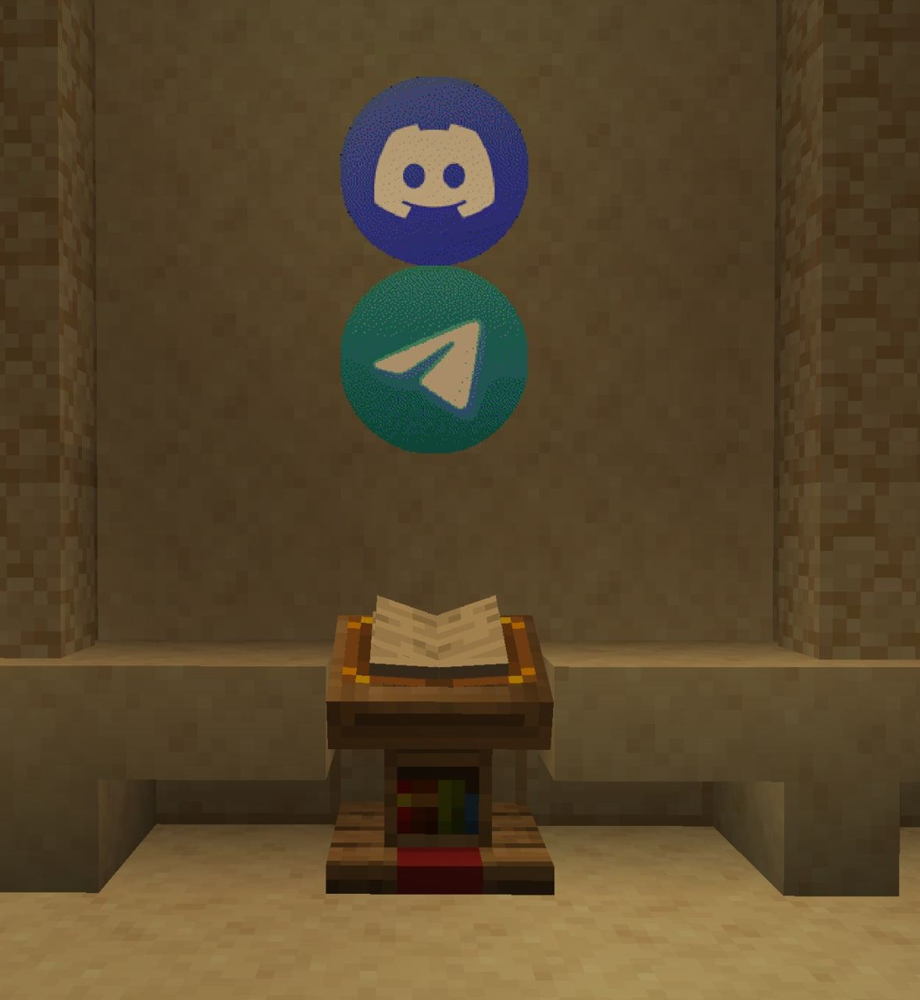

(3) When approaching the book right click and select [Add] for the type of Social handle you would like to link. 

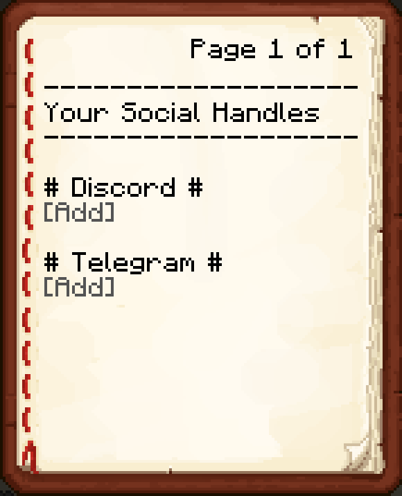

(4) Now open chat by typing T and type your telegram or discord handle, confirm by pressing enter. 

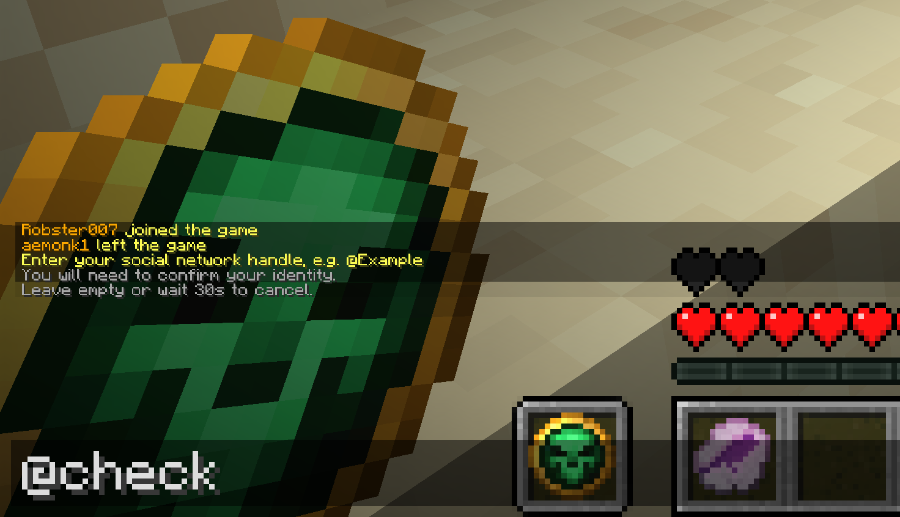

### **Adding the your Telegram Handle**

(5a) Following the entry of your handle into the chat, you will get a verification code which you can copy, this will then be used to verify with Telegram. After copying the code open a new chat in telegram with the Moonsama bot it has telegram handle **@msamabot** as shown below:

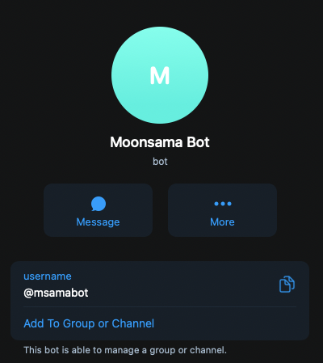

(6a) Select to message the bot and /start a new chat. Then enter your verification code and press enter. It may take a few minutes but you will then get a confirmation as per the following:

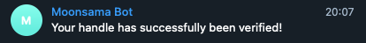

(7a) You have then successfully verified your Telegram account with your Moonsama bridge account. You can check your handle in Moonsama Minecraft by going back to the telegram point and right-clicking once more to see the following:

✅ **You have now completed linking your Telegram account. Thank you.** 

### **Adding the your Discord Handle**

(5b) Following the entry of your Discord handle into the chat, you will get a verification code which you can copy, this will then be used to verify with Discord:

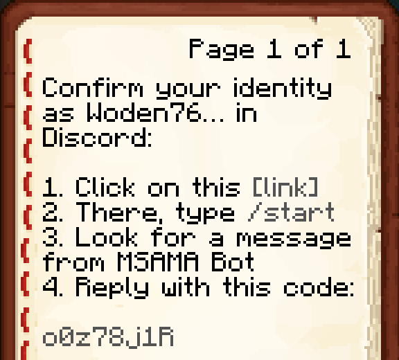

(6b) Firstly click on the verification code to copy it, then click on [link] as shown above. This will open the Social verification channel in Moonsama Discord:

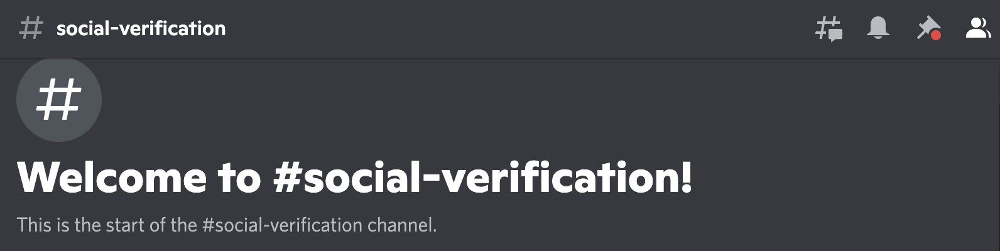

(7b) In the above channel type /start, now the MSAMA Bot will send you a DM (ensure you allow this in privacy settings):

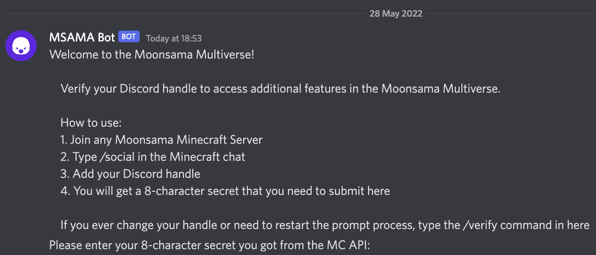

(8b) Reply to the message from MSAMA Bot with your verification code and press enter. You will then get a confirmation as per the following:

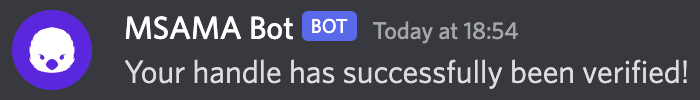

(9b) Now you have successfully verified your Discord account with your Moonsama bridge account. You can check your handle in Moonsama Minecraft by going back to the telegram point and right-clicking once more to see the following:

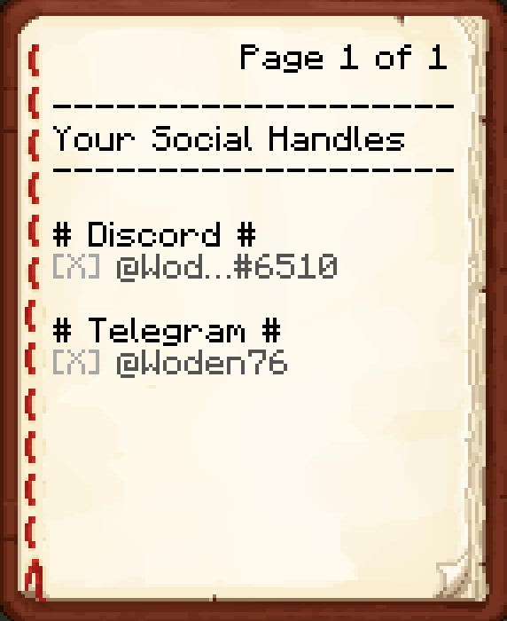

✅ **You have now completed linking your Discord account. Thank you.** 

## Server Types and Addresses

| Server | / Command | Server Address | Lesson covered | Information |
| --- | --- | --- | --- | --- |
| Chaos | /chaos | mc.moonsama.com | https://www.notion.so/12-Minecraft-Chaos-aa3150b63a6f4e41bf978f20cfe4be6b?pvs=21 | 24/7 server here you can roam free and most community events take place here |
| Canary | /canary | mc.moonsama.com | https://www.notion.so/13-Minecraft-Canary-a37830bd72d844bf9573a86f22688a39?pvs=21 | 24/7 epic city building & land ownership |
| Season | /season | mc.moonsama.com | https://www.notion.so/14-Minecraft-Season-d3865efc43f242f386a0e9e7d51e6bcf?pvs=21 | Competitive month long sessions with rewards for advancements and competitions |
| Carnage - EU/Asia

 | Not applicable | http://carnage-eu.moonsama.com/ | https://www.notion.so/15-Minecraft-Carnage-e4def94bf060444c85cf0576bc856ff8?pvs=21  | European/ Asian server for main Sunday event which yields resource rewards if you can hold on to them ;)

Available Sunday
16:00-18:00 UTC |
| Carnage - NA/Asia | Not applicable | http://carnage-na.moonsama.com/ | https://www.notion.so/15-Minecraft-Carnage-e4def94bf060444c85cf0576bc856ff8?pvs=21  | North American/ Asian server for main Sunday event which yields resource rewards if you can hold on to them ;)

Available Sunday
16:00-18:00 UTC |
| Carnage - Asia/Pacific | Not applicable | carnage-ap.moonsama.com | https://www.notion.so/15-Minecraft-Carnage-e4def94bf060444c85cf0576bc856ff8?pvs=21  | Asian and Pacific regional server for main Sunday event which yields resource rewards if you can hold on to them ;)

Available Sunday
16:00-18:00 UTC |
| Townhall | /townhall | mc.moonsama.com | https://www.notion.so/16-Townhall-6a3f7e4f8a284c8d82f062cb677bfe27?pvs=21 | For Moonsama community calls and also for the new on-chain democracy system to vote on proposals raised |
| Academy | /academy | mc.moonsama.com | https://www.notion.so/Introducing-Lokito-s-Academy-1e134dd609e343a79d7e525abd482339?pvs=21 | Lokito’s Academy server for Self Service Minecraft training |
