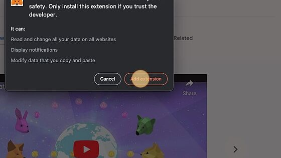
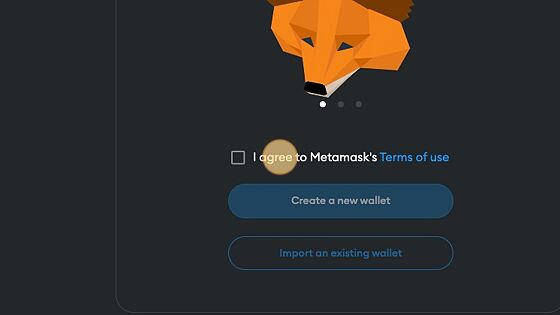
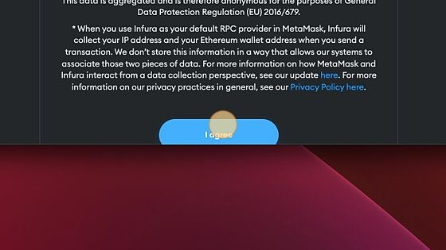
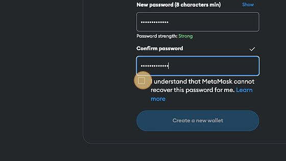
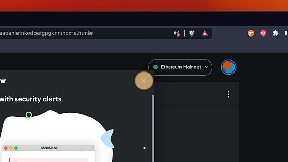
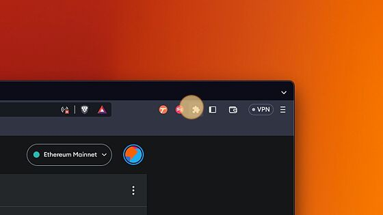
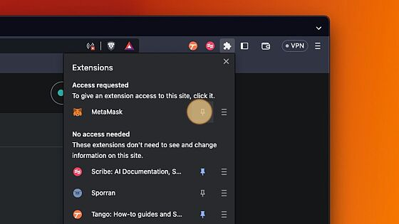

# Metamask set up

## Metamask

# Setting up Metamask wallet

See below for step-by-step instructions to set up your Metamask wallet - your gateway to web3 and Moonsama.

- Store crypto and NFTs with full control of your assets.
- Pay gas fees to access dapps, games and communities.
- Tap into the open internet - only requires minutes and the Metamask extension!

1. Navigate the Chrome Web Store and the extension [MetaMask](https://chrome.google.com/webstore/detail/metamask/nkbihfbeogaeaoehlefnkodbefgpgknn)

2. Click Add to Brave (or to the browser you are using)

3. Click the Add extension button

4. Click to agree Metamask's terms of use

5. Then click to create a new wallet

6. Agree to share usage

7. Enter a password for the wallet being created

8. Click and create a new wallet by selecting the button

9. Click Secure my wallet, this is recommended

10. Securely record and then confirm back your security recovery phrase when prompted

⚠️

Alert! Never share your Secret Recovery Phase and secure it safely as per the tips provided by Metamask as shown in the image above.

11. Confirm understanding and select Got It!

12. Close starter instructions

13. Select the extensions button

14. Toggle the extension onto browser bar for convenience

