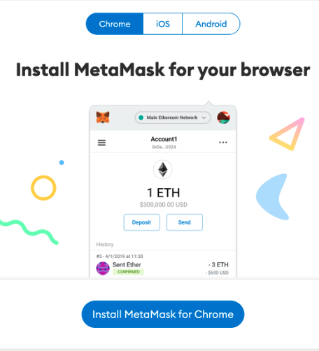
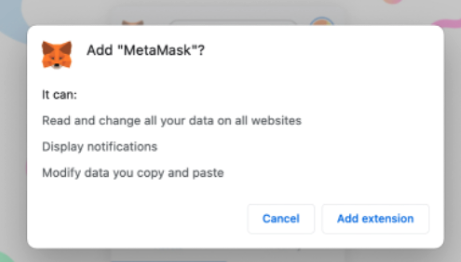

# 🦊 Getting a MetaMask Wallet

# Setting up MetaMask on Desktop

1. Go to [metamask.io](https://metamask.io) on a supported browser (Chrome, Firefox, Brave or Edge).
2. In this example, we are using the Chrome browser.
3. Click on “Download” or “Download now” on the page.
4. Click on “Install MetaMask for Chrome”.

5. It will take you to the “Chrome Web Store”.
6. Click on “Add to Chrome”.
7. The click on “Add extension” in the pop-up dialog.

8. A quick confirmation dialog that the MetaMask extension has been added will popup.

9. A MetaMask page will appear.

1. Click on the tiny puzzle to the right of the address/URL bar.
2. Click on the “Pin” in the window that pops up (now you have pinned your MetaMask wallet extension, which will always be there in the browser).

1. Click on the MetaMask’s Fox icon, which will bring up the “Get Started” page.
2. Click on “Get Started” and click on “Create a Wallet”.
3. Click on “I Agree” in the “Help us improve MetaMask” page.
4. Create an unique password in the “Create Password” page.
5. Read the details on the “Secure your wallet” page (This is important).
6. In the “Secret Recovery Phrase” page, click and reveal the secret words (This step is extremely important. These secret words are the ONLY keys to your cryptocurrency. Write them down in the same order and store them in a safe place).

:::note
The secret recovery phrase should be manually noted down and placed into safe location. It is highly recommended **NOT** to save the seed onto a cloud service or take a screenshot of it as this will potentially make it vulnerable for others to view or obtain. Please act carefully to safeguard your phrase for the protection of your assets and funds 🤝
:::

18. In the “Confirm your Secret Recovery Phrase” page, put the word phrases in their correct order and “Confirm”.

19. Next page is “Congratulations” and click on “All Done”.

1. Now you are all done with setting up the MetaMask extension on your web browser.
2. The same steps can be done also on Firefox, Brave, and Edge browsers.

# Setting up MetaMask on Mobile

1. On your iOS device, launch the App Store.
2. Go to “Search” and type in “Metamask”.
3. And “Get” the MetaMask app (In my case, I have already downloaded the app on another device, so it shows me the redownload icon).

4.  Once the app has downloaded, launch it and you should see.

5. Click on (Get Started), then (Create a new wallet).

 6. Click on (I Agree), and then create a unique password.

7.  Allow to use Face ID if desired.

8.  Click on (Start) until you get to the “Write down your Secret Recovery Phrase” page.

9. Write down your secret word phrases, in the order shown (these phrases are important as they are the **ONLY** key to your cryptocurrency being held in MetaMask).

1. In the “Confirm Secret Recovery Phrase” page, select the words in their correct order. And then, “Complete Backup”.
2. In the “Congratulations” page, click on “Done”.
3. And now your MetaMask wallet is ready receive and send cryptocurrency.

1. For Android OS, search for “MetaMask” in the Google Playstore.
2. The setup within the MetaMask is the same for both iOS and AndroidOS.
