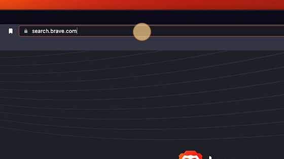
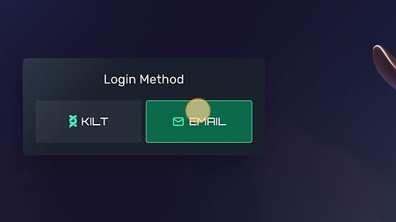
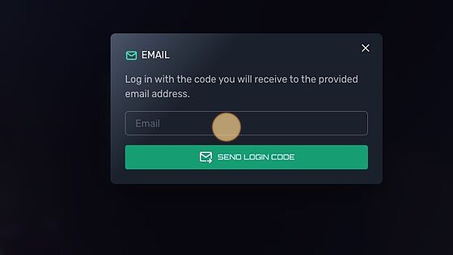
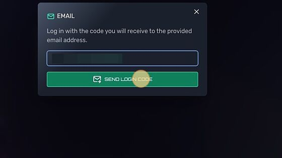
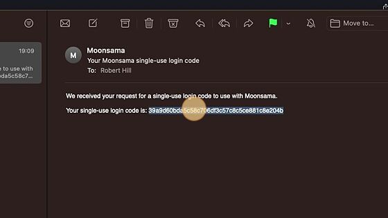
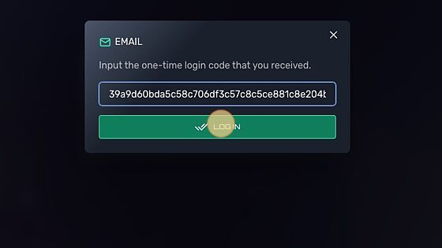
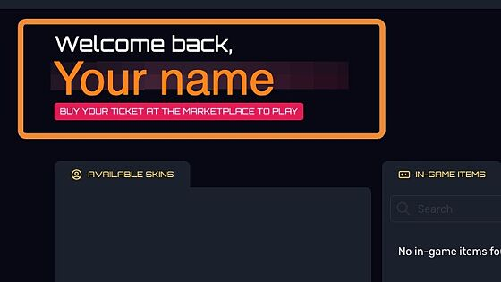

# Setting up Moonsama account

Please see the email based step by step instructions below for setting up or logging into your Moonsama Multiverse Portal account.

1. From your internet browser, go to the website: [multiverse.moonsama.com](https://google.fr/)

Please see the email based step by step instructions below for setting up or logging into your Moonsama Multiverse Portal account.1. From your internet browser, go to the website: [multiverse.moonsama.com](https://google.fr/)

2. On the login method select EMAIL

3. Enter your email

4. After entering email, select SEND LOGIN CODE

5. Select and open your email app

6. Find the Moonsama email with single-use login code

7. Copy your single-use login code to use for login

8. Paste the code back and log in

9. Congrats! Your Moonsama multiverse account has been created and you are also logged into the Moonsama Portal.

