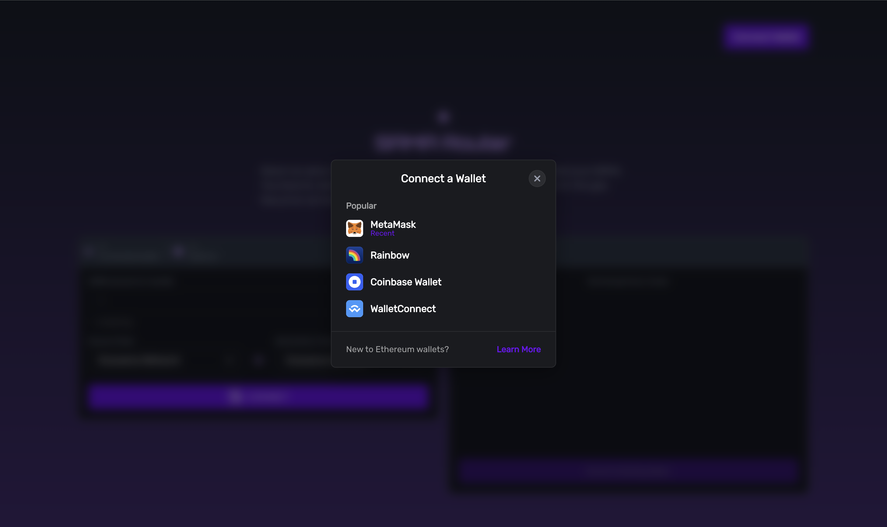
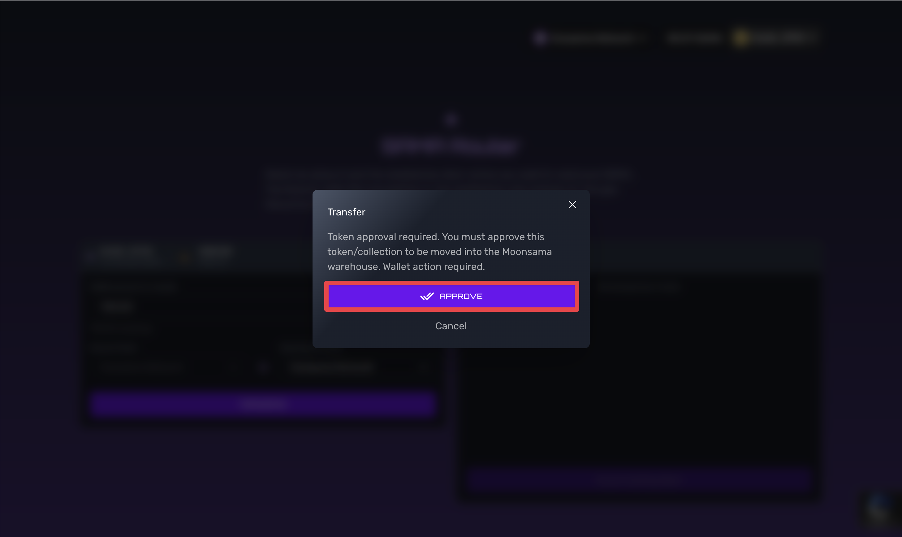
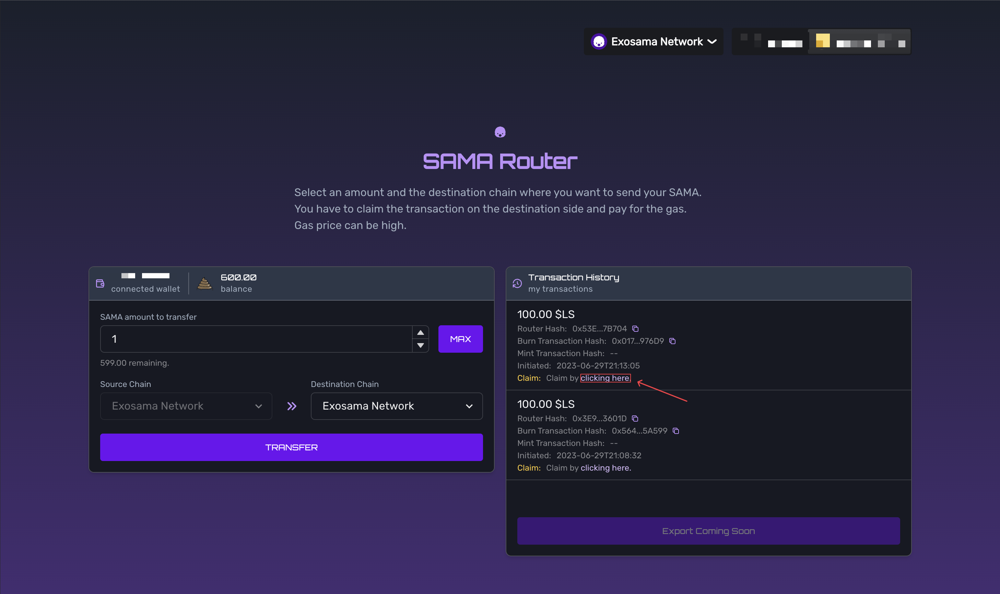

# Using Router

Moonsama router is used to moving sama token between the chains.

1. First go to [router.moonsama.com](https://router.moonsama.com/) page 

2. Click connect your wallet 

3. Select your wallet from the list 

For this guide we will be using Metamask

4. Choose destination chain (Source chain by default used the one set on wallet)

5. Choose amount of SAMA to transfer

6. Click to approve

7. Metamask will request to set spending for the contract. Please set amount that equals or greater to the one you want
to transfer.

:::note
The operations for setting spending cap and signing require gas, that means you have to spend native token for chain 
that you making transfer FROM (Source Chain), for claiming tokens you will pay gas in DESTINATION chain.
:::

8. After confirmation you will see transaction in transaction history.

9. To claim transaction on destination chain click here

