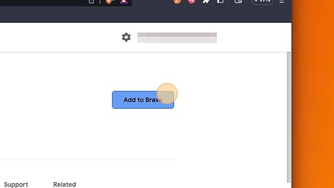
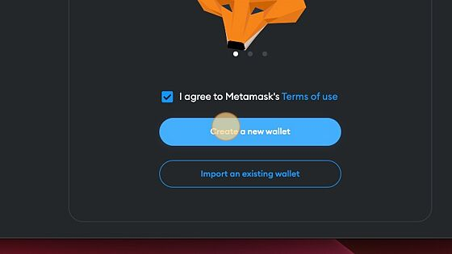
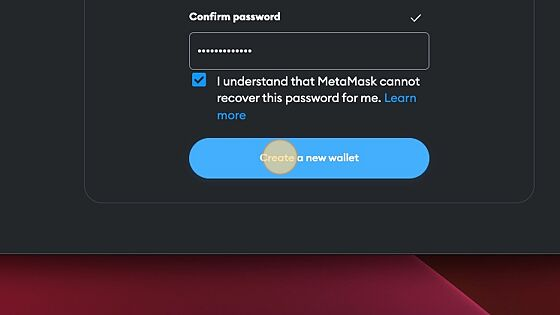
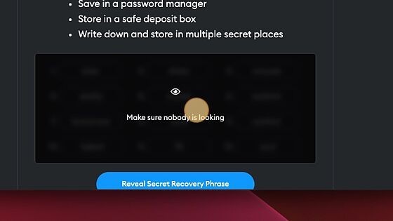
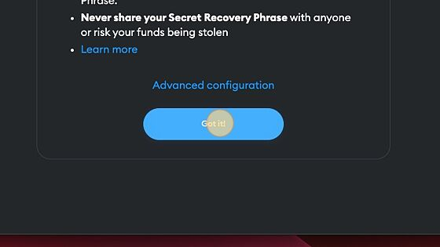

import ConnectToMetamask from '@site/src/components/connectToMetamask';

# Set up MetaMask

See below for step-by-step instructions to set up your MetaMask wallet - your gateway to Web3 and Moonsama.

- Store and interact with your Web3 assets.
- Access dApps, games and communities within Moonsama.
- Dive into the world of Web3 in just a few minutes with the MetaMask extension.

1. Navigate to the Chrome Web Store and download [MetaMask](https://chrome.google.com/webstore/detail/metamask/nkbihfbeogaeaoehlefnkodbefgpgknn)

2. Click "Add to Brave" (or any browser you're using)

3. Click the "Add extension" button

4. Click to agree with MetaMask's terms of use

5. Click to create a new wallet

6. Agree to share usage

7. Enter a password for the wallet being created

8. Click and create a new wallet by selecting the button

9. Click "Secure my wallet", this is recommended

10. Store your recovery phrase and then confirm your recovery phrase

⚠️

Alert! Never share your Secret Recovery Phase and secure it safely as per the tips provided by MetaMask as shown in the image above.

11. Confirm by selecting "Got It!"

12. Close the instructions

13. Select the extensions button on your browser

14. Toggle the extension onto browser bar to access MetaMask easily later

15. Click the button below to add Exosama Network automatically to MetaMask

<ConnectToMetamask chain="exosama" />
